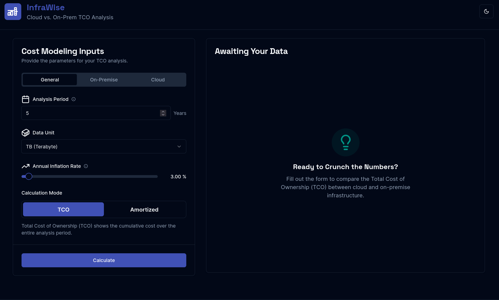

# InfraWise 📊

A financial modeling tool for comparing Total Cost of Ownership (TCO) between cloud and on-premise infrastructure solutions. Make informed infrastructure decisions with detailed cost breakdowns and breakeven analysis.

## Screenshot


## ✨ Features

- 💰 **Comprehensive TCO Analysis**: Compare cloud vs on-premise costs across hardware, software, power, bandwidth, and storage
- ⚖️ **Breakeven Analysis**: Identify when one solution becomes more cost-effective than the other
- 📈 **Interactive Visualizations**: View cost evolution through stacked bar charts and detailed tables
- 📊 **Export Capabilities**: Download complete analysis as CSV for reporting
- 🎨 **Responsive Design**: Clean interface with light/dark theme support
- 🔒 **TypeScript**: Full type safety throughout the application

## 🛠️ Tech Stack

- ⚡ **Framework**: Next.js 15 with App Router
- 📝 **Language**: TypeScript
- 🎨 **Styling**: Tailwind CSS
- 🧩 **UI Components**: Radix UI primitives with shadcn/ui
- 📋 **Forms**: React Hook Form with Zod validation
- 📊 **Charts**: Recharts
- 📦 **Package Manager**: pnpm

## 🚀 Getting Started

### Prerequisites

- Node.js 18+ 
- pnpm 8+

### Installation

1. Clone the repository:
```bash
git clone <repository-url>
cd infra-wise
```

2. Install dependencies:
```bash
pnpm install
```

3. Start the development server:
```bash
pnpm dev
```

The application will be available at `http://localhost:3000`.

## 📜 Available Scripts

- `pnpm dev` - Start development server with Turbopack ⚡
- `pnpm build` - Build for production 🏗️
- `pnpm start` - Start production server 🌐
- `pnpm lint` - Run ESLint with auto-fix 🧹
- `pnpm lint:check` - Check linting without fixes 👀
- `pnpm format` - Format code with Prettier ✨
- `pnpm format:check` - Check formatting without changes 🔍
- `pnpm typecheck` - Run TypeScript type checking 🔒

## 📁 Project Structure

```
src/
├── app/                 # Next.js app router pages
├── components/
│   ├── app/            # Application-specific components
│   ├── icons/          # Icon components
│   └── ui/             # Reusable UI components
├── hooks/              # Custom React hooks
└── lib/                # Utilities and types
```

## 🧑‍💻 Development

This project uses:
- 🧹 **ESLint** for code linting
- ✨ **Prettier** for code formatting
- 🔒 **TypeScript** for type safety
- 🎨 **Tailwind CSS** for styling

Run `pnpm lint` and `pnpm typecheck` before committing changes.

## 📄 License

Private project - All rights reserved.